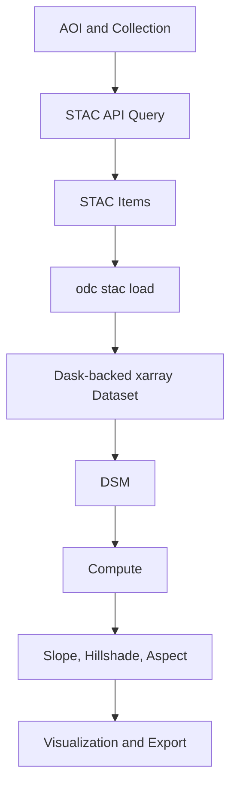

# Cloud-Native Terrain Analysis with STAC

This repository demonstrates a scalable approach to working with high-resolution Digital Elevation Model (DEM) data—without downloading large datasets locally.

Using a cloud-native workflow built on:

- STAC (SpatioTemporal Asset Catalog)
- xarray
- Xarray-spatial
- Open Data Cube (ODC)
- Dask
- hvplot and plotly for visualization

the pipeline queries, loads, and processes terrain data directly from cloud-hosted sources.

## Purpose

This project showcases a modern geospatial data workflow for:

- Efficient access to large raster datasets
- Reproducible, scalable analysis
- Deriving terrain features (e.g., slope, hillshade)

These features are commonly used in downstream geospatial data science and machine learning applications.
