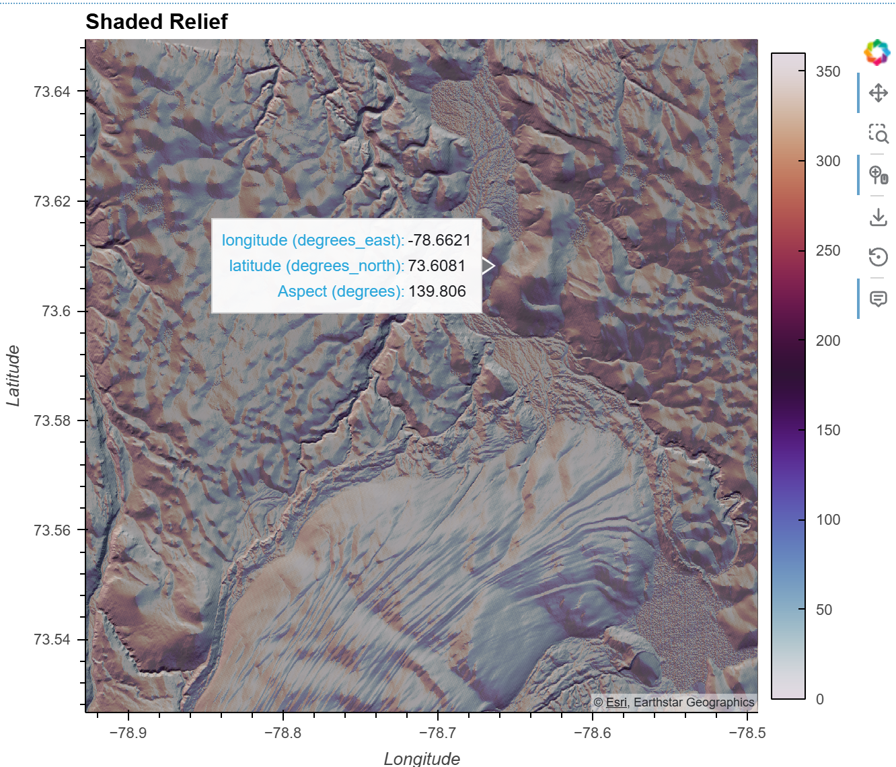
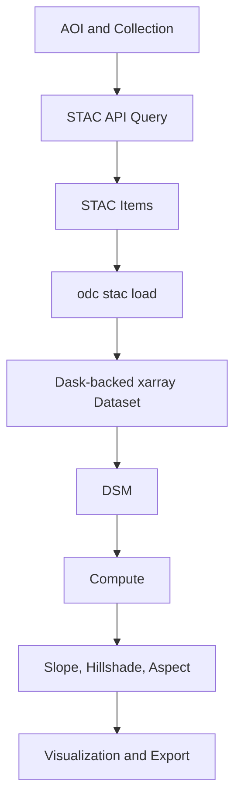

# Cloud-Native Terrain Analysis with STAC

This repository accompanies the article: https://aychatammour.com/writing/cnd_arctic_dem/cnd_dem_stac.html

This project demonstrates a scalable approach to working with high-resolution Digital Elevation Model (DEM) data—without downloading large datasets locally.

Using a cloud-native workflow built on:

- STAC (SpatioTemporal Asset Catalog)
- xarray
- Xarray-spatial
- Open Data Cube (ODC)
- Dask
- hvplot and plotly for visualization

## Purpose

This project showcases a modern geospatial data workflow for:

- Efficient access to large raster datasets
- Reproducible, scalable analysis
- Deriving terrain features (e.g., slope, hillshade)

These features are commonly used in downstream geospatial data science and machine learning applications.

The pipeline queries, loads, and processes terrain data directly from cloud-hosted sources.

## Key Features

+ Cloud-native access to DEM datasets
+ Parallelized processing with Dask
+ Interactive visualization workflows
+ Reproducible geospatial analysis pipeline
+ No need for local storage of large raster files

## Example Applications

+ Arctic terrain analysis
+ Environmental monitoring
+ Hydrology and watershed studies
+ Remote sensing workflows
+ Terrain-based machine learning features

For a full walkthrough and explanation of the workflow, please [read the article](https://aychatammour.com/writing/cnd_arctic_dem/cnd_dem_stac.html)

